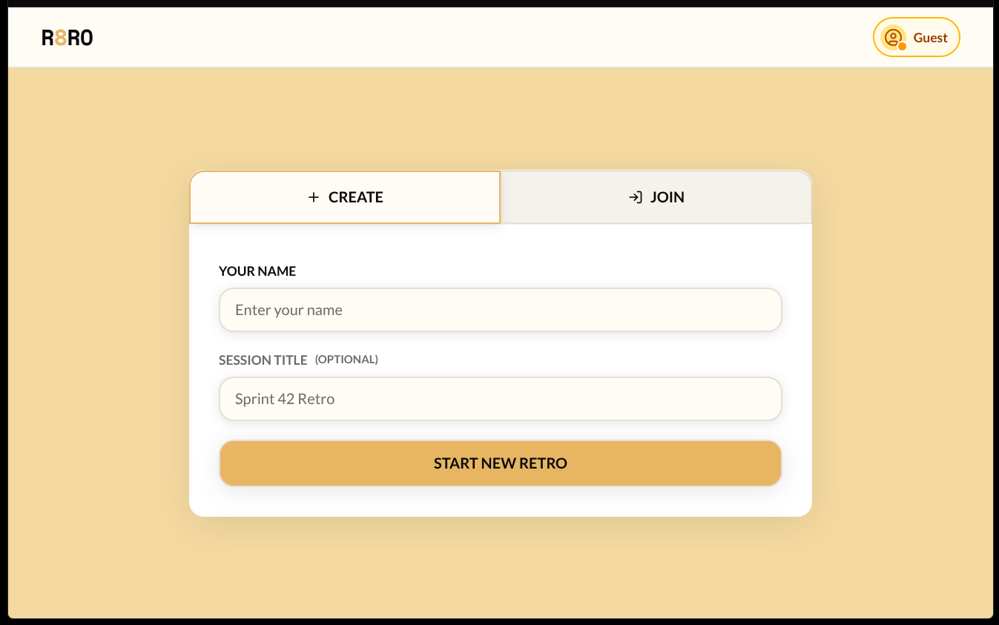
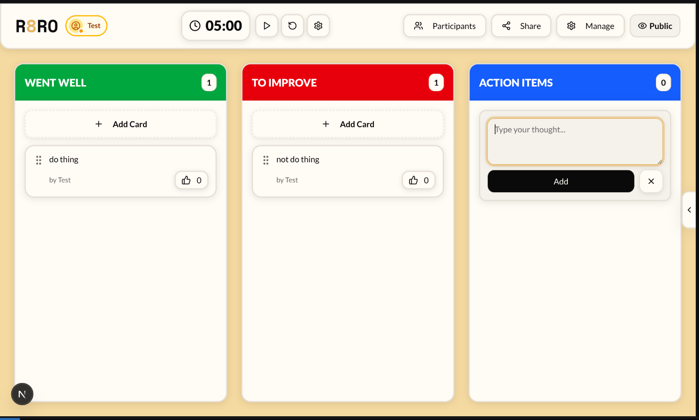
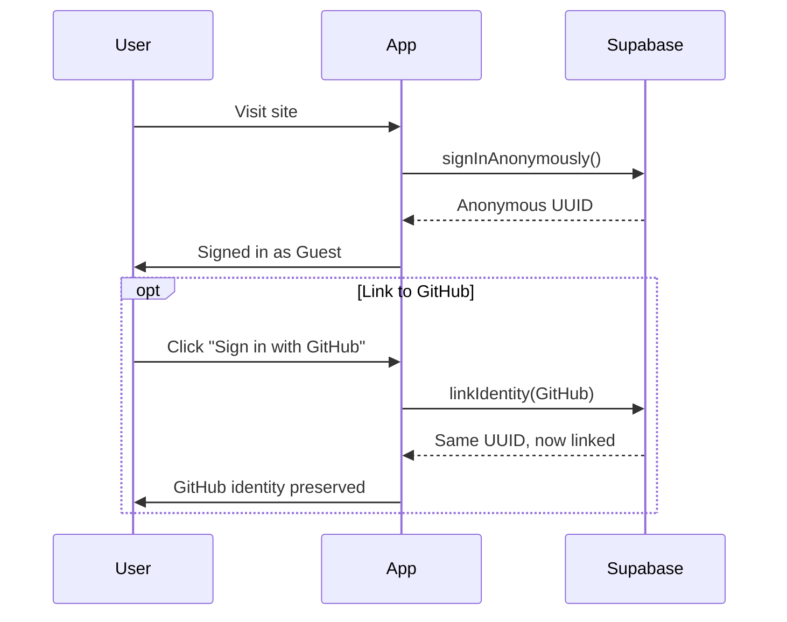
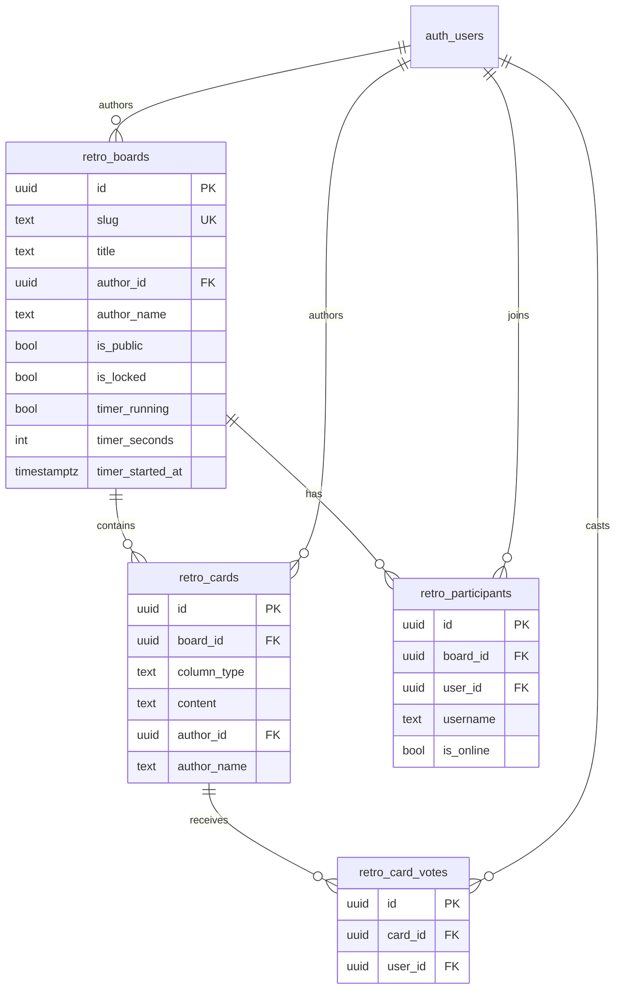
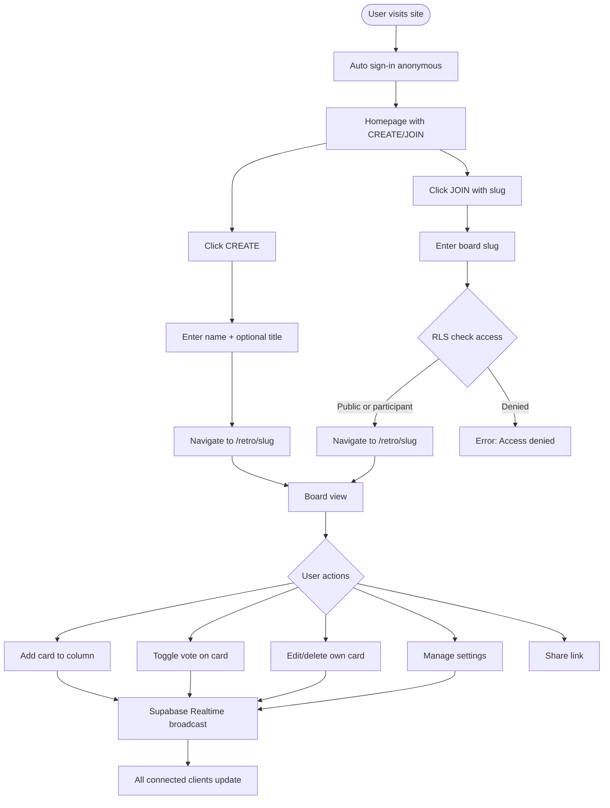
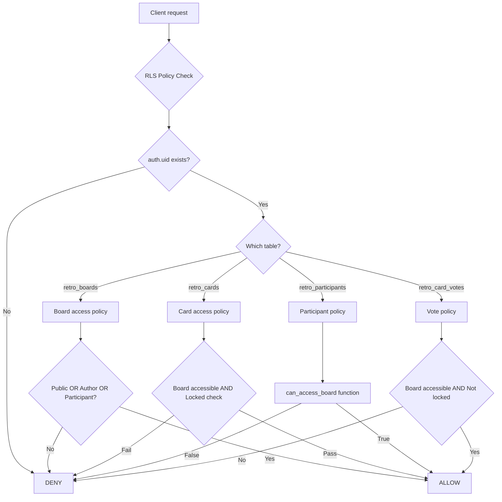

# r8ro

[](https://opensource.org/licenses/MIT)
[](https://r8ro.app)

Realtime collaborative retrospective boards. Anonymous-first with GitHub auth binding.




## Features

### Core

- **Anonymous-first auth** — Auto sign-in as guest, optional GitHub binding to preserve identity
- **Realtime collaboration** — Live updates for cards, votes, participants via Supabase Realtime
- **3-column retro format** — Went Well / To Improve / Action Items
- **Vote tracking** — Toggle votes on cards, prevents duplicates, tracks per user
- **Timer** — Built-in session timer with play/pause/reset
- **Recent boards** — Local history of visited boards

### Scrum Poker

- **Configurable voting scales** — Fibonacci, T-shirt sizes, and linear presets (extendable via `lib/constants/poker-scales.ts`)
- **Admin controls** — Start/stop voting, reveal/hide cards, clear votes, and toggle public/private visibility
- **Observer mode** — Participants can join read-only to watch estimates without voting
- **Realtime participants & presence** — Mirrors retro flows with dedicated components under `components/poker/`
- **Statistics** — After reveal, the table surfaces min/max/average and outlier cues for the current story

### Access Control

- **Public boards** — Anyone can join, add cards, vote
- **Private boards** — Only previous participants can access
- **Locked boards** — Author-only write, everyone else read-only
- **Author privileges** — Only authors can delete their boards

### Permissions Matrix

| Action           | Public        | Private           | Locked            | Author |
| ---------------- | ------------- | ----------------- | ----------------- | ------ |
| View board       | Anyone authed | Participants only | Participants only | ✓      |
| Join board       | ✓             | ✗                 | ✗                 | ✓      |
| Add cards        | ✓             | Participants      | Author only       | ✓      |
| Edit own cards   | ✓             | Participants      | Author only       | ✓      |
| Delete own cards | ✓             | Participants      | Author only       | ✓      |
| Vote             | ✓             | Participants      | Read-only         | ✓      |
| Delete board     | ✗             | ✗                 | ✗                 | ✓      |

## Tech Stack

- **Framework** — Next.js 16 (App Router) + React 19
- **Language** — TypeScript
- **Styling** — Tailwind CSS 4 + shadcn/ui
- **Database** — Supabase (PostgreSQL + Realtime + Auth)
- **Deployment** — Vercel

## Architecture

### Authentication Flow



### Data Model



### User Flow



### RLS Policy Architecture



## Project Structure

```
r8ro/
├── app/
│   ├── new/route.ts              # Board creation API
│   ├── retro/[slug]/
│   │   ├── page.tsx              # Board page (server)
│   │   └── RetroPageClient.tsx   # Board UI (client + realtime)
│   ├── poker/[slug]/             # Scrum poker session route
│   │   ├── page.tsx
│   │   └── PokerSessionClient.tsx
│   └── client-page.tsx           # Homepage
├── components/
│   ├── ui/                       # shadcn/ui primitives
│   ├── retro/                    # Retro board components
│   └── poker/                    # Planning poker components
├── hooks/
│   └── use-auth.ts               # Auth state hook
├── lib/
│   ├── supabase/
│   │   ├── client.ts             # Browser client
│   │   ├── server.ts             # Server client
│   │   └── proxy.ts              # Proxy for env vars
│   ├── types.ts                  # TypeScript types
│   └── utils/
│       ├── slug.ts               # Slug generation
│       └── recent-*.ts           # Local history helpers for retro/poker
└── supabase/
    ├── schema.sql                # Complete schema dump
    ├── RLS_POLICIES.md           # RLS documentation
    └── README.md                 # Schema overview
```

## Documentation

- `docs/README.md` — index of every doc plus authoring conventions.
- `docs/overview.md` — high-level product summary and architecture highlights.
- `docs/features/retro.md` / `docs/features/poker.md` — deep dives into each realtime experience.
- `docs/data-model/supabase.md` — canonical schema + RLS reference linked to migrations.
- `docs/operations.md` — local setup, Supabase introspection steps, and documentation refresh checklist.
- `docs/deployment.md` — comprehensive deployment guides for various platforms.

## Development

### Setup

```bash
# Install dependencies
pnpm install

# Set up environment variables
cp .env.example .env.local
# Add your Supabase URL and anon key

# Run dev server
pnpm dev
```

### Environment Variables

```bash
NEXT_PUBLIC_SUPABASE_URL=your_supabase_url
NEXT_PUBLIC_SUPABASE_ANON_KEY=your_supabase_anon_key
```

### Database Setup

Apply schema from `supabase/schema.sql`:

```bash
# Using Supabase CLI
supabase db reset

# Or apply manually via Supabase Dashboard
# Copy contents of supabase/schema.sql to SQL Editor
```

### Commands

- `pnpm dev` — Start dev server
- `pnpm build` — Production build
- `pnpm lint` — Run ESLint

## Contributing

Contributions are welcome! Please read our [Contributing Guidelines](CONTRIBUTING.md) for details on our code of conduct and the process for submitting pull requests.

### Quick Start for Contributors

1. **Fork** the repository
2. **Clone** your fork locally
3. **Create** a feature branch: `git checkout -b feature-name`
4. **Set up** local development:

   ```bash
   pnpm install
   cp .env.example .env.local
   # Add your Supabase credentials
   pnpm dev
   ```

5. **Make changes** and follow the code style in `AGENTS.md`
6. **Submit** a pull request with clear description

See [docs/operations.md](docs/operations.md) for detailed development setup.

## Deployment

r8ro can be deployed on various platforms. See [docs/deployment.md](docs/deployment.md) for comprehensive deployment guides including:

- **Vercel** (recommended for simplicity)
- **Netlify**
- **Docker containers**
- **Self-hosted VPS**
- **Cloud providers** (AWS, Google Cloud, etc.)

## Author

Created by **[Griko Nibras](https://grikomsn.com)** - a full-stack developer focused on collaborative tools and real-time applications.

## Security

- All tables protected by Row Level Security (RLS)
- Helper function `can_access_board()` prevents recursion in participant checks
- Policies optimized with `(SELECT auth.uid())` pattern for performance
- Anonymous users get full Supabase Auth UUIDs (can be upgraded to GitHub)

See [`supabase/RLS_POLICIES.md`](supabase/RLS_POLICIES.md) for detailed policy documentation.
